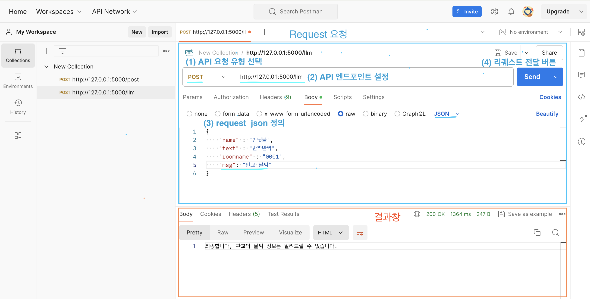

# 프로젝트 목표
- Overall Goal: 카카오 부트캠프에 특화된 챗봇 개발 

## AI 파트의 목표 
: 챗봇 input 이 들어오면 RAG와 CHATGPT API를 이용하여 적절한 답변을 반환하는 AI 서버 개발 
- flask 기반 백엔드 서버 개발
- RESTful API 기반 

## 참고 블로그 
- [링크](https://github.com/leejin-kyu/RAG_simple/blob/main/gradio%EB%A1%9C_PDF_%EC%B1%97%EB%B4%87_%EC%9B%B9%EC%84%9C%EB%B9%84%EC%8A%A4_%EA%B5%AC%ED%98%84%ED%95%98%EA%B8%B0_%EC%88%98%EC%A0%95.ipynb) 

## 사전 준비 
 
0. 가상환경을 원한다면, 가상 환경 만들고 activate
~~~python 
    python -m venv {가상환경이름}
    source {가상환경이름}/bin/activate
~~~

1. python 및 필요한 라이브러리들 설치   
- python version 은  3.12.4 로 설치하기
- 라이브러리 설치 
`pip install requirements.txt`

2. postman에 가입한다. [링크](https://www.postman.com/)  

3. ~~RAG에서 검색하고 싶은 PDF 파일 구비~~   
- ~~11조 -> 보안 문제로 지은에게 문의 주시면 pdf 파일을 드리겠습니다~~
- ~~pdf 파일을 data 디렉토리 내에 넣음. ~~


4. mongo DB 설치 
[참고](https://www.mongodb.com/ko-kr/docs/manual/tutorial/install-mongodb-on-os-x/)


4. API key 발급 받기
(11조 -> 다 발급 받지 마시고 지은에게 문의 주시면 환경 변수 파일을 드리겠습니다. )
총 4개의 API 키가 필요하다(openweathermap, open ai, tmap, kakao map)  
각 사이트에 들어가서 API를 발급 받고, .env 파일을 만들어서 다음과 같이 지정해준다. 

~~~python
    OPENAI_API_KEY = sk-proj-xxx
    WEATHER_API_KEY= xxx ... 
    KAKAO_MAP_API_KEY1 = KakaoAK xxx..
    TMAP_API_KEY = xxx..
    LOCATION1 = Seongnam-si
~~~
  + 날씨를 알고 싶은 지역을 LOCATION1에 저장해준다. 
    .gitignore 파일에 .env 파일명 추가하기
    : git에 업로드할 에정이라면, .gitignore 파일에 .env를 추가하여 api 키가 외부에 노출되지 않게 해야함.   

~~5. 맥북이라면 airplay OFF를 꺼주세요. ~~  
- ~~airplay가 포트 5000번을 차지하기 때문에, flask 앱이 실행이 되지 않음.~~  
- ~~System Preferences -> General -> AirDrop & Handoff -> OFF~~

6. MongoDB 설치 하기.
 * Mac
    1. 홈브류 설치 확인. 미설치시에만 아래 코드 실행
    ```
    /bin/bash -c "$(curl -fsSL https://raw.githubusercontent.com/Homebrew/install/HEAD/install.sh)"
    ```
    2. 몽고DB tap 추가
    ```
    brew tap mongodb/brew
    ```
    3. 몽고 DB 설치
    ```
    brew install mongodb-community@7.0
    ```
    4. 몽고DB 서비스 시작
    ```
    # 백그라운드 자동 실행 설정
    brew services start mongodb/brew/mongodb-community
    # 1회성 수동 실행 코드
    mongod --config /opt/homebrew/etc/mongod.conf --fork
    ```
    5. 몽고DB 상태 확인
    ```
    brew services list
    ```
    6. 몽고DB쉘 실행 : 데이터베이스에 직접 접근하기 위한 명령어
    ```
    mongosh
    ```
    7. 몽고DB 종료
    ```
    brew services stop mongodb/brew/mongodb-community
    ```
    
## 서비스 실행
0. RAG 옵션이 바뀌었거나, rag markdown 문서가 업데이트 되었을 때 
/data/retrievers/faiss_index 내의 파일들을 삭제해줍니다. 

1. app.py 의 file_path 나의 pdf 이름으로 바꿔줌 
~~~python
# 검색할 문서 로드 
file_path = 'data/ktb_data_09.md'# PDF 경로를 지정해주기 - 추후에 모든 pdf 읽도록  바꾸도록 지정하기 
try:
    retriever = my_retriever(file_path)
except OpenAIError as e:
    raise e
print("검색기 로드 끝")
~~~

2. app 실행   
터미널에 다음 명령어를 실행 : `python app.py`  
그러면 터미널에 localhost:5001에 서빙이 잘 되었다는 메시지가 뜬다. 

3. (test)postman에 로그인해서 테스트를 위한 HTTP request를 생성해준다. 


(1) API 요청 유형을 선택한다. - POST 유형 선택한다.   
(2) API 엔드포인트 주소 선택 - http://127.0.01:5001/conv으로 설정한다.   
(3) Request 데이터 정의 - 아래와 같이 json 형식으로 전달할 데이터를 정의함   
~~~python
{
    "content": "판교 날씨"
}
~~~
- content 필드에 사용자 예상 질문을 넣는다. 

(4) 전송 버튼 클릭 
- 클릭하면 하단 결과 창에서 LLM 모델이 생성한 답변을 확인할 수 있다. 


## 주요 함수 설명 
- `app.py`: 메인 함수, 답변 출력하는 AI flask 서버 정의 
  - POST 유형의 RESTful request가 들어오면 다음과 같은 4가지 질문 카테고리를 분류하여 적절한 답변을 생성한다.   
    (1) 카카오 부트 캠프 관련 질문(e.g. 훈련장려금 지급에 대해서 알려줘)  
    (2) 날씨 관련 질문(e.g. 오늘 날씨 어때?)  
    (3) 교통 관련 질문(e.g. 서울역에서 판교까지 어떻게 가?)  
    (4) 기타 질문(e.g. 오늘 뭐할지 추천해줘.)

- `document_retriever.py`: 검색 증강(RAG)를 위한 함수
  - pdf읽기, vectorDB 만들기, PDF 검색기 등 정의 

- `get_weather.py`: 날씨 정보를 얻어오는 api(open weather api를 사용)
- `find_routes_v2.py`: 목적지와 출발지 간 최적 경로를 실시간으로 받아오는 역할(kakaomap, tmap api 사용)
- `error_handler.py`: flask error handler를 정의


### 기타 
#### 날씨 API : [OpenWeatherMap API](https://openweathermap.org/api/one-call-3)
- 가져올 수 있는 정보: 강우량, 온도, 습도 ... 
- 정해진 형식으로 출력을 교과서적으로
  - prompt 엔지니어링

- 사용자 질문 예시
  - 오늘 날씨 어때? 
  - 오늘 비와? 
  - 오늘 습도 어때?
  - 오늘 코트 입어도 돼? 

response 예시 
~~~python 
{
  "base": "stations",
  "clouds": {
    "all": 3
  },
  "cod": 200,
  "coord": {
    "lat": 37.4386,
    "lon": 127.1378
  },
  "dt": 1722661444,
  "id": 1897000,
  "main": {
    "feels_like": 307.46,
    "grnd_level": 999,
    "humidity": 47,
    "pressure": 1006,
    "sea_level": 1006,
    "temp": 305.52,
    "temp_max": 306.81,
    "temp_min": 305.52
  },
  "name": "Seongnam-si",
  "sys": {
    "country": "KR",
    "id": 5513,
    "sunrise": 1722631035,
    "sunset": 1722681476,
    "type": 1
  },
  "timezone": 32400,
  "visibility": 10000,
  "weather": [
    {
      "description": "clear sky",
      "icon": "01d",
      "id": 800,
      "main": "Clear"
    }
  ],
  "wind": {
    "deg": 274,
    "gust": 3.26,
    "speed": 3.26
  }
}
~~~


#### 활용할 정보 
전체적인 정보는 다음과 같아: weather 객체 이용   
세부 요소는 다음과 같다 : main, wind, clouds, rain, snow  

<필수>
- weather: 주요 기상상태 요약해줌 
  - Group of weather parameters (Rain, Snow, Clouds etc.)
  - 요소  
    - weather.main: Rain, Snow, Clouds 등 
    - weather.description: 해당 기상에 대한 정보 
  - 활용 방안 : 'main: description' 형태 

- main : 온도, 습도, 기압에 대한 구체적인 수치를 담고 있음
  - 요소  
    - temp: Kelvin >  Celcious 변환 필요. 
    - feels_likepressure: 단위- hPa
    - humidity: 단위 %

- wind : 풍속 정보 담고 있음 
  - 요소
    - clouds.all: %
- clouds : 풍속 정보 담고 있음 
  - 요소
    - wind.speed: meter/sec

<날씨에 따라서 가변적으로 들어오는 요소>  
snow, rain : 지난 시간 동안의 강우량/강설량을 얻을 수 있다. 

snow
- snow.1h(where available) Snow volume for the last 1 hour, mm. 
- snow.3h (where available)Snow volume for the last 3 hours, mm.
rain
- rain.1h(where available) Snow volume for the last 1 hour, mm. 
- rain.3h (where available)Snow volume for the last 3 hours, mm.


### 교통 API 연결
- 문제: 다양한 유형의 교통 질문에 응답해야함. 
  - chatgpt 실시간 데이터 연결이 안돼서, 사용자의 질문 의도에 맞는 적절한 API를 연결해주기 어려움
  - 활용할 수 있는 API 
    - 실시간 길찾기: TMAP 대중교통 API 
   
   - 예시 질문: 
      - A에서 B까지 가는 가장 빠른 대중교통 경로는? 
  
  <details>
  <summary>예상 질문</summary>
  <div markdown="1">

    대중교통 경로 탐색  
    **A에서 B까지 가는 가장 빠른 대중교통 경로는? 
    A에서 B로 가는 지하철 경로를 알려줘.  
    A에서 B까지 몇 번 버스를 타야 해?  
    A에서 B까지 가는 대중교통 소요 시간은 얼마야?  
    A에서 B까지 가는 가장 저렴한 경로는?  
    
    
    버스 도착 정보  
    ** C 번 버스 몇 분 남았어?  
    C 번 버스 지금 어디야?  
    
    ** C 번 버스 다음 정류장에 몇 시에 도착해?  
    ** C 번 버스 첫차와 막차 시간 알려줘.  
    D 정류장에서 C 번 버스 언제 와?  
    
    지하철 정보
    E역에서 F역까지 몇 번 라인을 타야 해?  
    E역에서 F역까지 가는 마지막 지하철 시간은?  
    E역에서 F역까지 소요 시간은 얼마야?  
    E역에서 F역까지 가는 가장 빠른 지하철 노선은?  
    E역에서 F역까지 가는 도중 환승역은 어디야?  
    
    기타 교통 정보  
    A에서 B까지 가는 택시 요금은 얼마야?  
    A에서 B까지 가는 자전거 대여소는 어디야?  
    A에서 B까지 걸어가면 얼마나 걸려?  
    오늘 C번 버스 운행 중단됐어?  
    D 정류장에서 가장 가까운 지하철역은 어디야?  

  </div>
  </details>

<<<<<<< Updated upstream
## 서비스 관리

### 사용자 대화 기록 관리
1. MongoDB Compass 설치
[링크](https://www.mongodb.com/try/download/compass)
설치 : MongoDB Compass Download (GUI)

2. 연결하기
    1. add new connection
    2. URL : --
    3. "Advanced Connection Options" 항목의 "Authentication"
      * username : admin
      * password : --
      * Authentication Database : admin
      
      
3. 몽고 DB 데이터 로컬에서 확인
    1. MongoDB 서버 실행 확인
    ```
    mongod
    ```
    2. MongoDB쉘 접근
    ```
    mongo
    ```
    3. data 베이스 선택 및 확인
    ```
    use chatbot_db  # 데이터베이스 선택
    show collections  # 콜렉션 목록 확인
    db.chat_history.find().pretty()  # chat_history 콜렉션의 모든 데이터 확인
    ```